# Word Bloom

[繁體中文](#繁體中文) · [English](#english)

## 繁體中文

Word Bloom 是一個學科英語練習遊戲。玩家輸入完整英文答案，消除逐漸膨脹的氣球；配合英文讀音、老師自訂題庫、單題回訪及學習報告，練習拼寫與詞義。

目前為純前端網站，資料保存在瀏覽器，亦可匯出 save 帶走。支援繁體中文／英文介面、深色／淺色主題。

## 開始遊玩

首頁按「開始練習」，選擇預設關卡或已匯入的題庫。

| 關卡 | 任務 | 例子 |
|---|---|---|
| Lv1 | 看英文，打英文 | compare → compare |
| Lv2 | 看中文，打英文 | 比較 → compare；計算 → calculate / compute |
| Lv3 | 學科常見反義詞 | hot → cold；above → below |
| Lv4 | 看短英文釋義，猜學科指令 | give reasons → explain；name or recognise → identify |

每種預設題型有十題。Lv 編號用來區分題型；玩家可直接選關。老師可匯入更多提示及可接受答案。


淺色繁中介面：首頁提供練習入口，右上角可切換主題及介面語言。圖中亦有進度／save／老師報告入口。

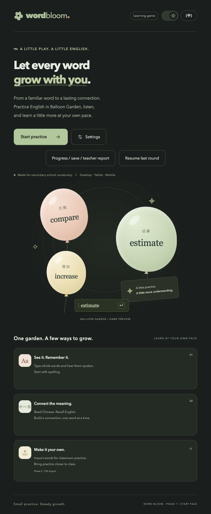

深色英文介面：切換介面語言不會改變題庫的提示及答案。

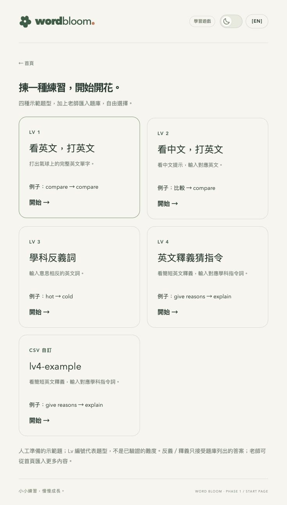

四種預設題型各有任務說明與提示→答案例子，可直接選擇練習。

## 氣球遊戲

- 題目隨機排列，氣球由圓形遊戲區中央附近慢慢漲大並向外移動。
- 在輸入框輸入完整英文，按 **Enter** 提交；**Backspace** 修改、**Esc** 或清空按鈕清除輸入。
- 答對消除對應氣球，顯示綠色爆破；開啟讀音時播放英文答案。
- 答錯震動輸入框；依設定保留或清空文字，生命不扣。
- 氣球超時顯示紅色爆破並扣一點生命；每回合有三點生命。
- 可暫停及續玩；完成後查看逐題結果、重聽、重玩或前往下一關。
- 多答案依題庫清單判定，忽略大小寫與首尾空白。

### Lv1：看英文打英文

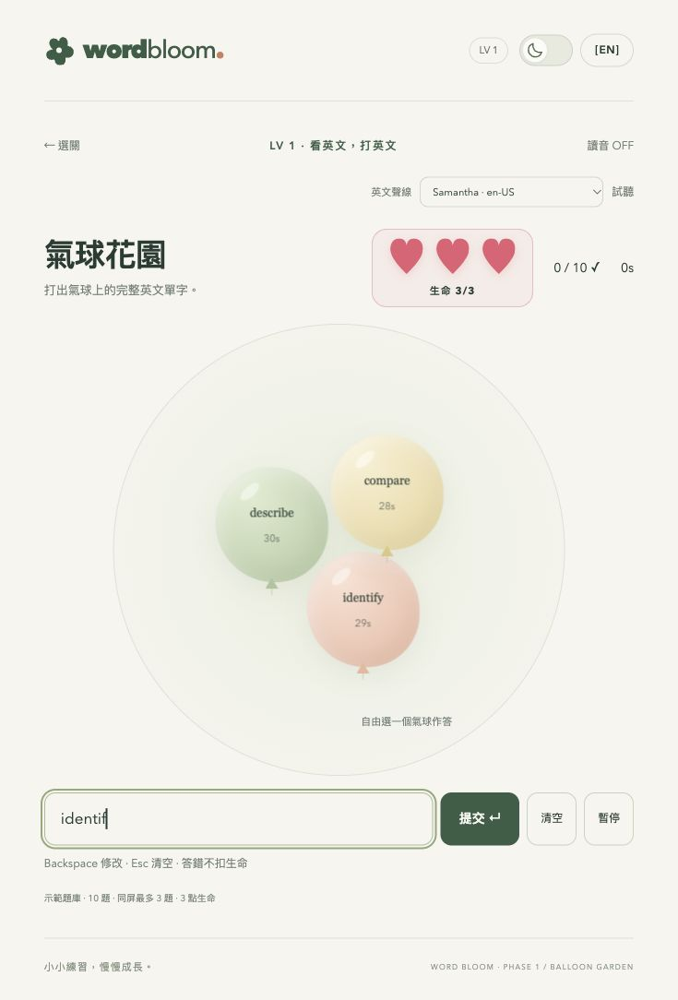

遊玩中同屏有 identify、describe、compare；輸入框正在打 `identif`，未按 Enter 不算提交。氣球及倒數完全可見，沒有暫停遮罩。

### Lv2：中文提示打英文

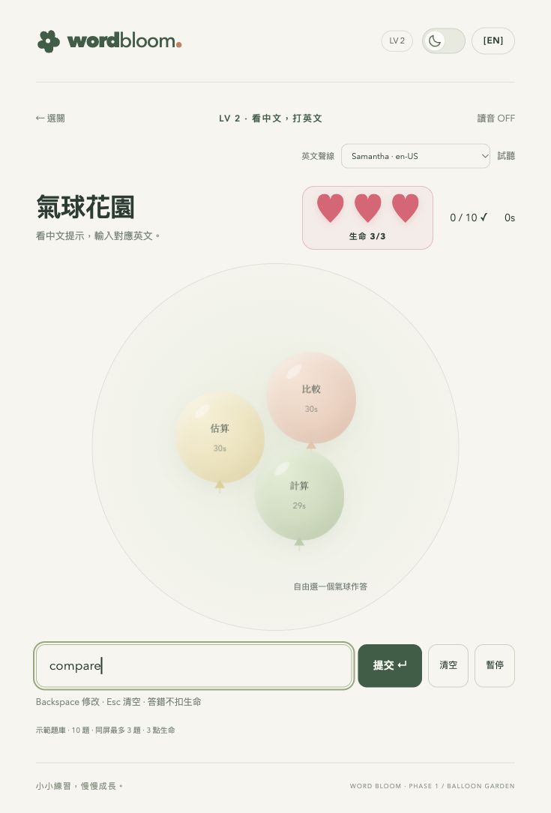

同屏提示比較、計算、估算；輸入框已填 `compare`，等待按 Enter 消除「比較」。答對時讀的是英文答案。

### Lv3：反義詞

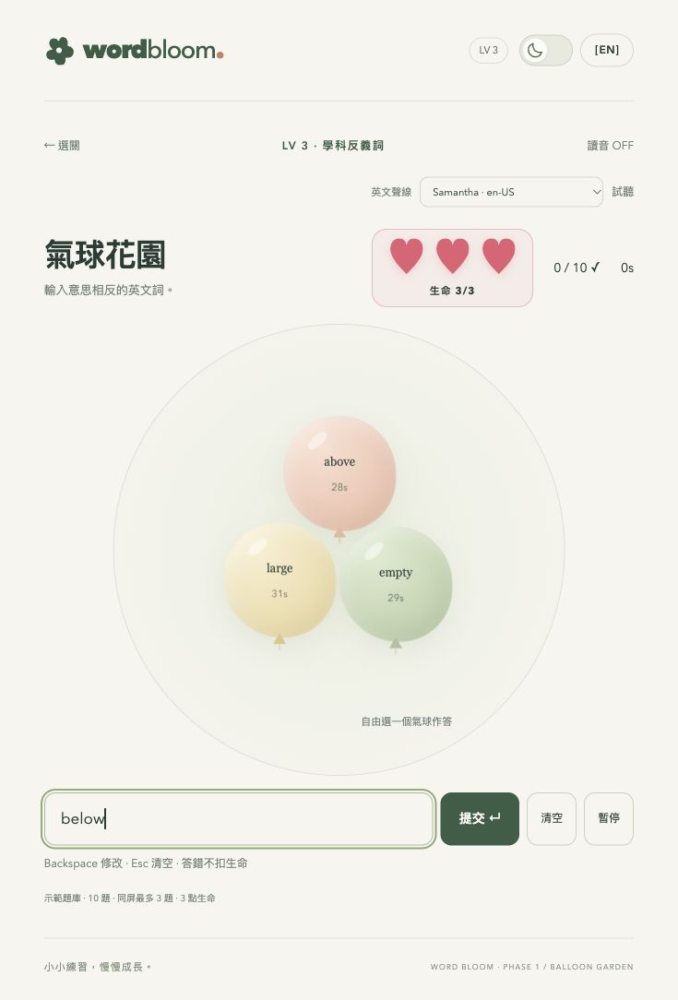

同屏 above、empty、large；輸入框填 `below` 對應 above。學生需要想反義答案，不能直接照抄提示。

### Lv4：英文釋義猜指令

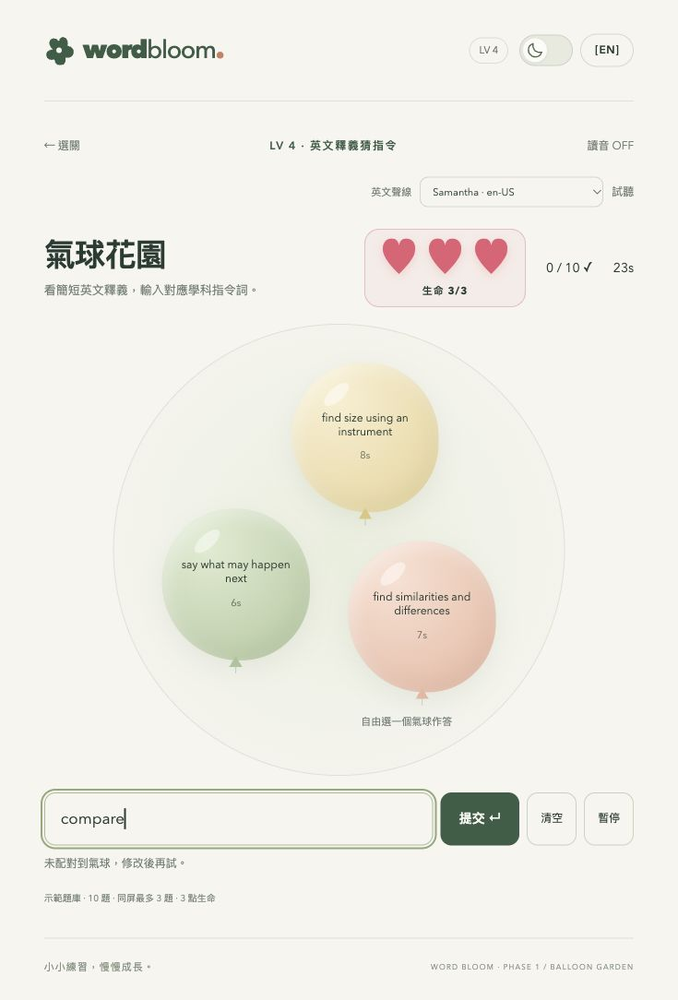

同屏 find similarities and differences、say what may happen next、find size using an instrument；輸入框已把錯字 `compar` 改成 `compare`，等待再提交。畫面顯示23秒已過，氣球漲大向外移動；多詞提示會分行顯示。

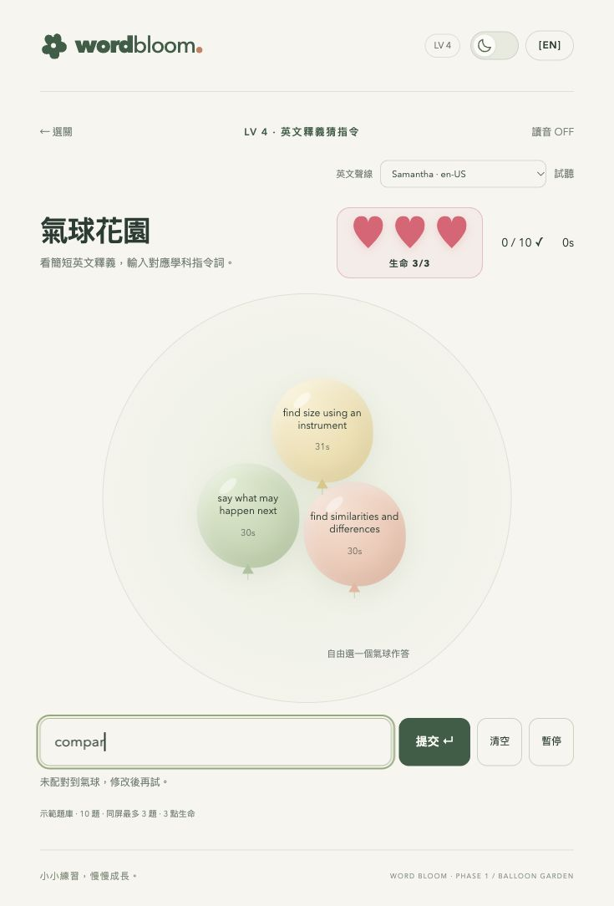

提交 `compar` 未匹配後，保留文字並提示修改；生命仍是3/3，氣球倒數繼續。

### 答對、超時與結果

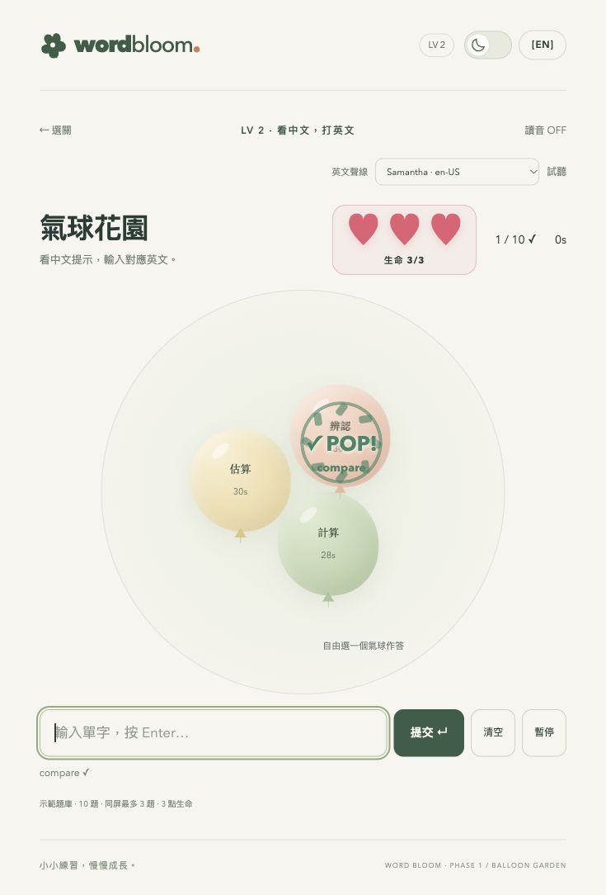

Lv2 提交 `compare` 後，答對數變成1/10，出現綠色 `✓ POP!` 和 `compare ✓`；生命保留，並補入「辨認」新題。

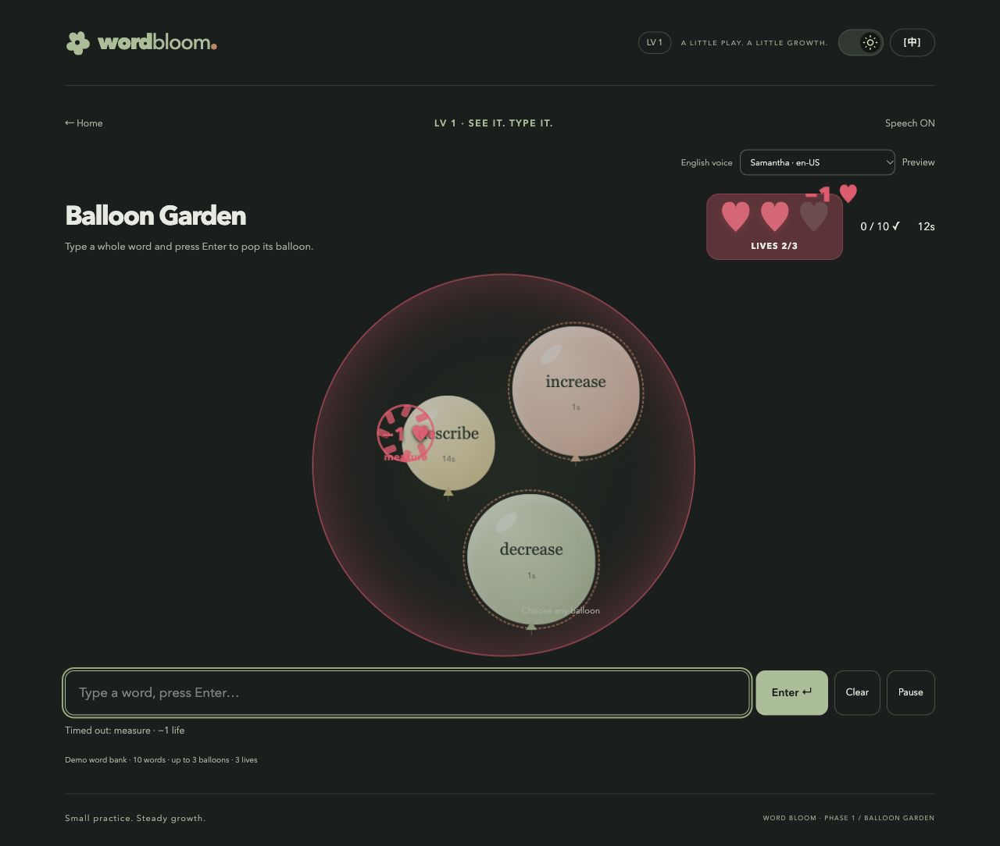

超時出現紅色粒子與 `−1 ♥`，大心心和生命數字同步更新。

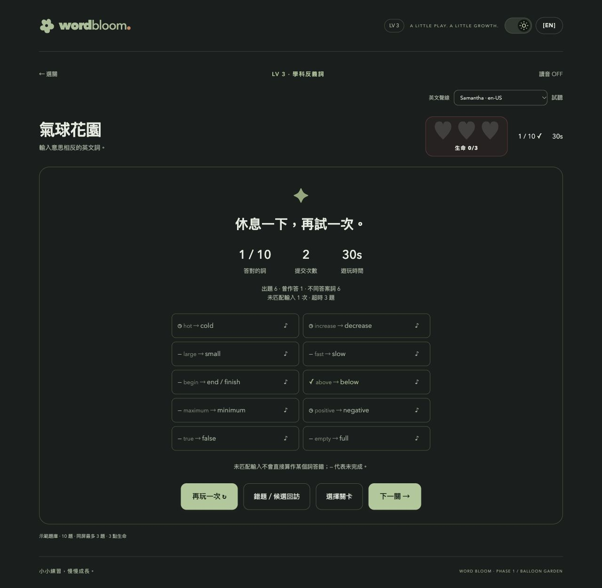

此示範回合答對一題、超時三題後結束。結果分開顯示答對、超時、未完成，以及題數和提交次數；未做過的題目不當作答錯。

## 自訂設定

首頁「設定」提供：

| 選項 | 可設定內容 |
|---|---|
| 同屏氣球 | 1、2 或 3 個 |
| 速度 | 快約10–14秒、中約18–22秒、慢約28–32秒 |
| 答錯處理 | 保留文字或自動清空 |
| 英文讀音 | 開／關、聲線選擇及試聽 |

設定保存於本機，供新回合使用；續玩保留該回合原設定。TTS 使用瀏覽器提供的英文聲線，優先選 Google 英文（若可用），否則使用系統聲線；不需 GenAI API 或逐題 token。

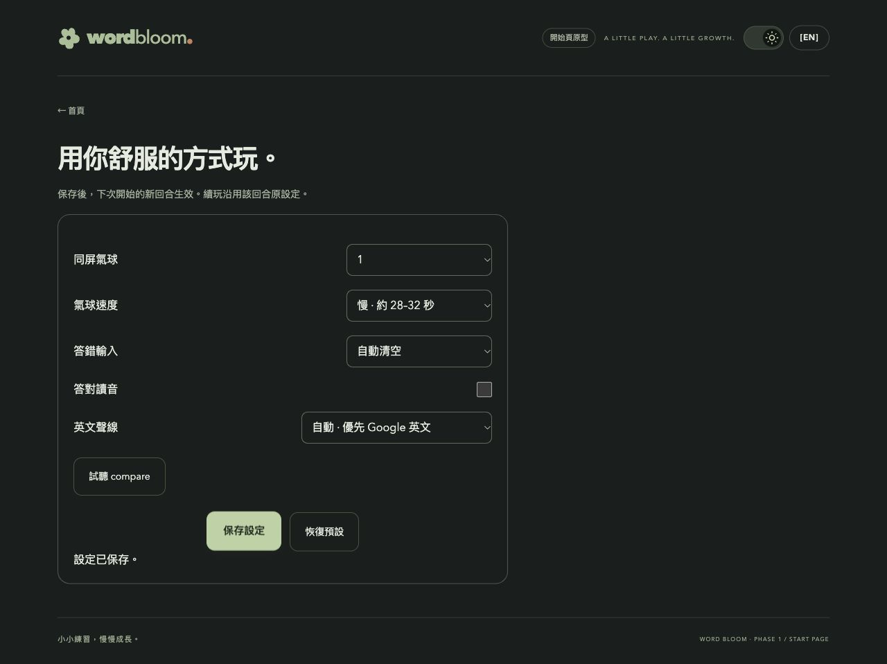

畫面示範一個氣球、慢速、答錯清空及讀音關閉。保存後開始新回合便會套用。

## 老師 CSV 題庫

首頁「匯入」先選任務，再下載範本、準備題目、匯入預覽及保存。自訂題庫會出現在選關頁。

固定四欄，後兩個答案可以留空：

```csv
prompt,answer,answer2,answer3
計算,calculate,compute,
比較,compare,,
```

- 每題一個提示，最多三個可接受答案；內容由老師決定。
- 支援 UTF-8 CSV、引號內逗號及換行；建議在試算表以 UTF-8 CSV 匯出。
- 每個檔案最多1 MB、1–500題。
- 本版同一題庫的答案不能跨題重複；遇到格式或重複答案錯誤會提示，已保存題庫不被覆蓋。

現有範本：[Lv1](csv-examples/lv1-example.csv) · [Lv2](csv-examples/lv2-example.csv) · [Lv3](csv-examples/lv3-example.csv) · [Lv4](csv-examples/lv4-example.csv)。

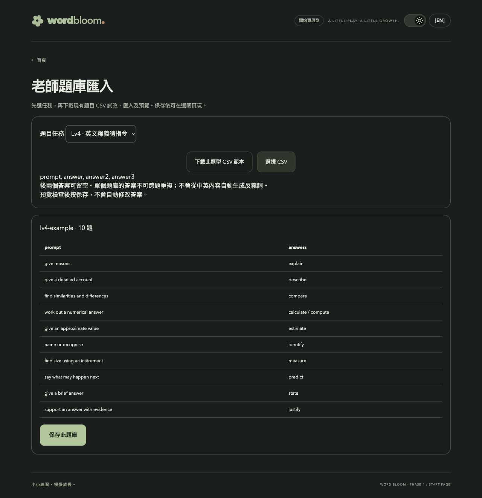

Lv4 範本匯入後先預覽提示與答案，核對多答案，再按保存。

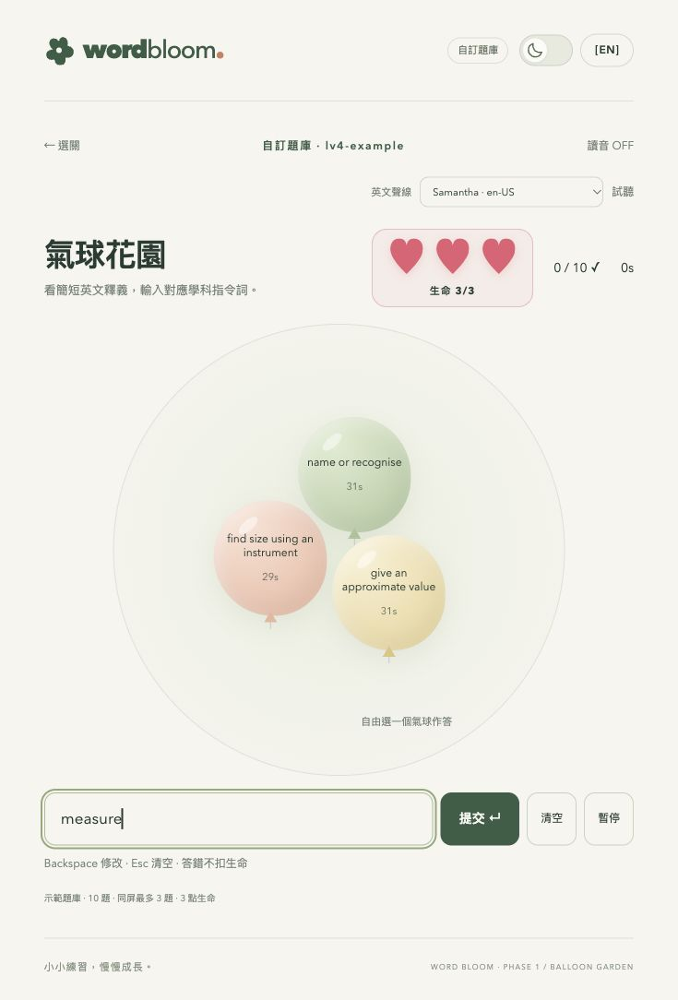

CSV 保存後即可使用氣球玩法。圖中自訂 lv4-example 題庫正輸入 `measure`，對應 find size using an instrument；倒數、生命及輸入框都可見，沒有暫停遮罩。

## 學習歷史及 save

首頁「進度／save／老師報告」可以查看跨回合紀錄、開啟回訪及管理存檔。

| 指標 | 意義 |
|---|---|
| 回合／遊玩時間 | 玩了幾回合，前景且未暫停的遊戲時間 |
| 出題次數 | 實際顯示過的題目數，跨回合累加 |
| 曾作答題數 | 該回合可確認作答目標的不同題數 |
| 提交次數 | 包括錯字和重試；一題試三次是三次提交 |
| 不同答案詞 | 已出題的主要答案詞去重計數 |
| 氣球答對／未匹配 | 成功匹配及未匹配輸入分開統計 |
| 回訪提交 | 單題回訪作答另外計算 |

- 本機自動保存回合、題庫、設定、逐次提交、日期、同屏題及氣球漲度。
- 匯出 JSON save 可作備份；匯入驗證後合併，相同回合不重複計算。
- 未完成氣球回合可以續玩，沿用原題目、生命及設定。
- 回訪歷史會保存；重新開啟回訪由第一題開始，沒有保存頁面索引。

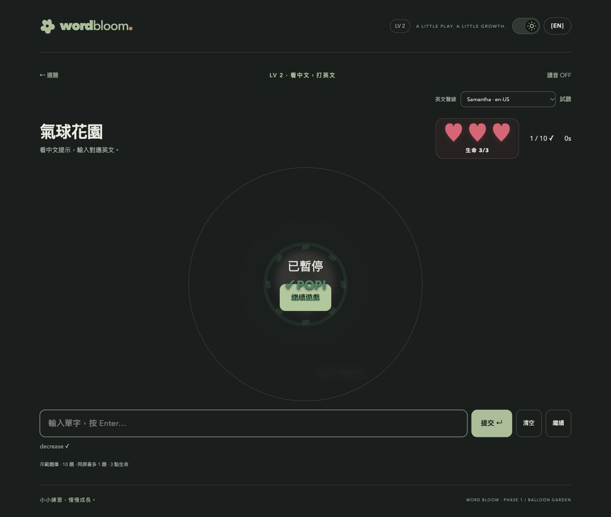

暫停阻止倒數和提交，之後可繼續同一回合。

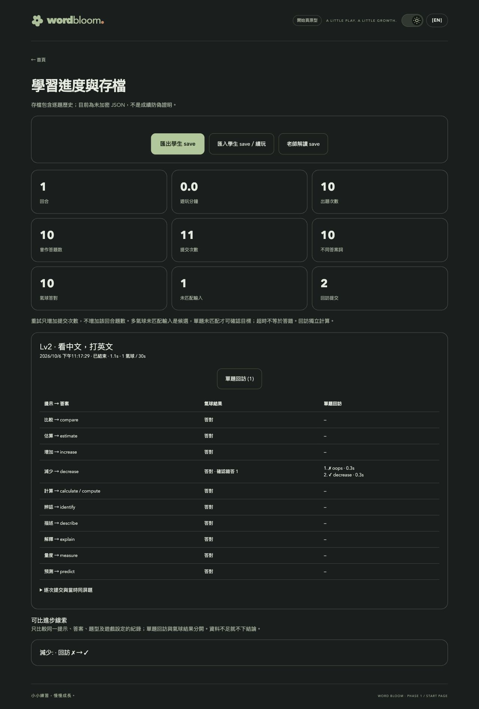

學生可查看摘要、逐題結果及回訪，再匯出或匯入 save。

## 錯答候選與單題回訪

共用輸入框有多個氣球時，未匹配輸入無法確認目標。系統記錄當時同屏候選；單題回訪只出一題，才可確認該次對錯。原候選與超時紀錄保持原狀。

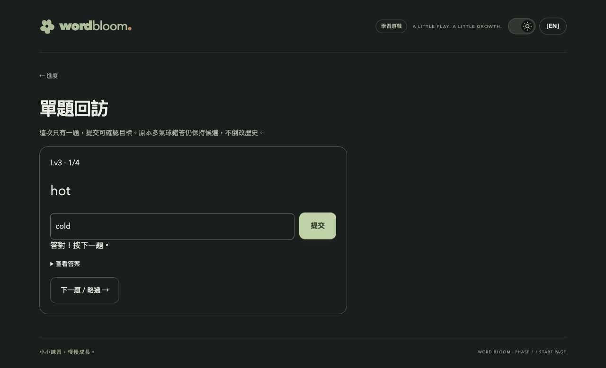

`hot` 回訪先答 `warm` 未配對，再改成 `cold` 答對；兩次輸入及時間都保留。

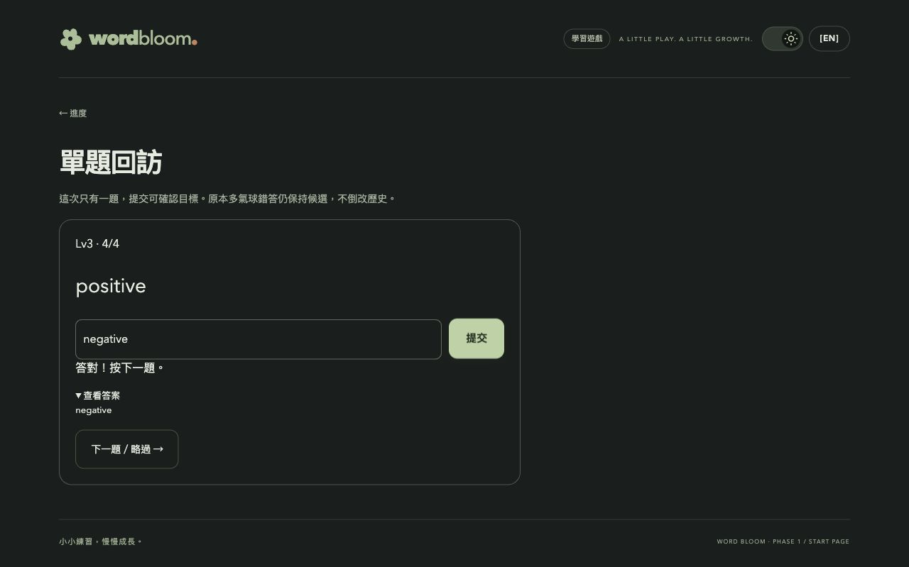

展開答案後再答 `negative`，紀錄會標「已看答案」，與無提示作答分開。

## 老師存檔報告

在「進度／save／老師報告」選「老師解讀 save」，讀取學生 JSON。報告獨立顯示，不修改本機學生進度。

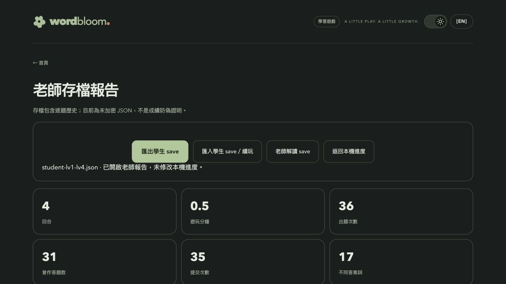

四關示範共4回合、36次出題、35次提交、31個氣球答對及9次回訪提交。

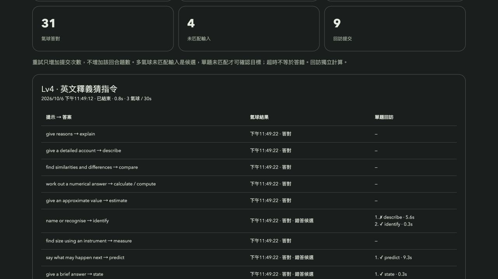

同一列呈現提示→答案、氣球結果與單題回訪。`name or recognise` 的回訪由 `describe ✗` 改為 `identify ✓`，每次有時間紀錄。

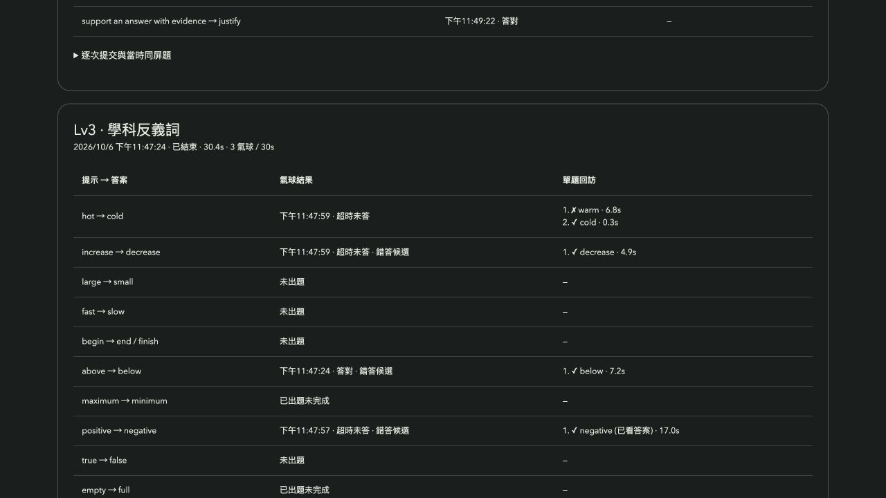

`hot` 原本超時，回訪先錯後對；`positive` 答對但已看答案。未出題、已出未完成、超時及錯答候選都有不同標記。

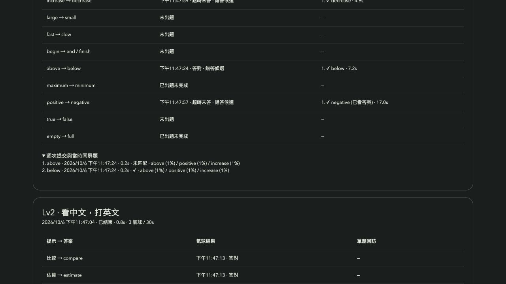

展開逐次提交可看輸入、日期、回合時間，以及當時同屏提示與漲度；方便追溯未匹配紀錄。

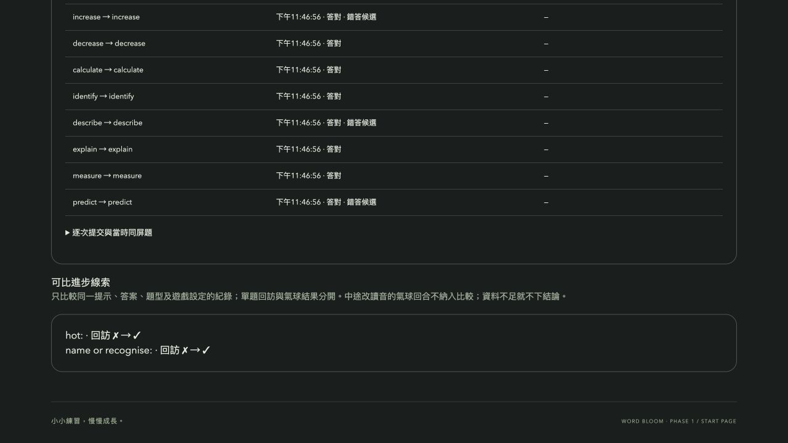

相同提示、答案、題型及設定的紀錄才比較。氣球結果與無提示回訪分開；看過答案的回訪不納入無提示比較。

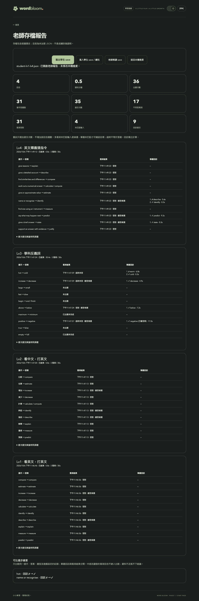

完整報告由摘要、四關逐題資料到可比線索。若需閱讀細字，可使用上面的單關截圖。

可自行讀取 [四關示範 save](demo-saves/student-lv1-lv4.json)；操作說明在 [示範資料 README](demo-saves/README.md)。截圖及存檔都是自動操作測試資料，不是真實學生；快速提交的時間不能作速度基準，錯後即場重試也不代表長期進步。

## 使用範圍

- 有基本響應式布局；專門手機／平板模式與真機軟鍵盤操作仍待完善。
- 本機資料跟隨瀏覽器及網站來源；清除瀏覽器資料前請先匯出備份。
- Save 目前為未加密 JSON，不是防偽成績證明。支援存檔版本1及最多5 MB。
- 目前沒有帳戶、雲端同步、班級管理、逐關課程派發或排行榜。
- 英文聲線取決於裝置／瀏覽器。示範反義及釋義只接受題庫列出的答案，老師可按課堂需要準備內容。

## GitHub Pages

已附 `.github/workflows/pages.yml`。在目標 repository 的 Settings → Pages 選 GitHub Actions，推送到 `main` 後會執行測試、建置及發布；亦可手動執行 workflow。建置使用相對資源路徑，支援 repository 子路徑。此流程已在本機建置驗證，實際線上網址仍需發布後檢查。

## 本機執行

需要 Node.js 20.19+ 或22.12+。

```bash
npm install
npm run dev
```

開啟終端機顯示的網址，預設為 `http://localhost:5173`。

```bash
npm test
npm run build
npm run preview
```

使用 Vite、React、TypeScript 及 Tailwind CSS；氣球以 DOM／CSS 呈現，英文讀音用瀏覽器 Speech Synthesis。題庫在 `src/data/levels.ts`，主要樣式在 `src/styles.css`。

---

## English

Word Bloom is an academic English practice game. Players type complete English answers to pop expanding balloons. Spoken answers, teacher-provided question banks, single-question reviews and learning reports support practice with spelling and meaning.

The current app runs entirely in the browser. Progress is stored locally and can be exported as a save file. The interface supports Traditional Chinese and English, with light and dark themes.

### Start playing

Select **Start practice** on the home page, then choose a preset level or an imported question bank.

| Level | Task | Example |
|---|---|---|
| Lv1 | Copy an English word | compare → compare |
| Lv2 | Read Chinese, type English | 比較 → compare; 計算 → calculate / compute |
| Lv3 | Type a subject-related antonym | hot → cold; above → below |
| Lv4 | Identify a command word from a short English meaning | give reasons → explain; name or recognise → identify |

Each preset contains ten questions. Level numbers identify task types; players can choose any level directly. Teachers can import additional prompts and accepted answers.


The home page includes practice, settings and progress/save/teacher-report controls. Theme and language switches are in the top-right corner.


Changing the interface language does not change the question bank's prompts or answers.


Each task card explains what to type and shows a prompt-to-answer example.

### Balloon gameplay

- Questions are shuffled. Balloons gradually expand and move outward from near the centre of the circular play area.
- Type a complete answer and press **Enter**. Use **Backspace** to edit, or **Esc** / the clear button to clear the input.
- A correct answer pops its balloon with green feedback. When speech is enabled, the English answer is spoken.
- An unmatched answer shakes the input. Text is kept or cleared according to settings; it does not cost a life.
- A timed-out balloon bursts with red feedback and costs one life. Each round starts with three lives.
- Pause and resume a round. After a round, inspect question results, replay pronunciations, play again or move to the next level.
- Answers are checked against the question bank's accepted list, ignoring letter case and surrounding whitespace.

#### Lv1: Copy an English word


The visible balloons are identify, describe and compare. The player has typed `identif`; nothing is submitted until Enter is pressed. Balloons and countdowns remain visible without a pause overlay.

#### Lv2: Chinese to English


The prompts are 比較, 計算 and 估算. The input contains `compare`, ready to pop 比較 on submission. Speech reads the accepted English answer.

#### Lv3: Subject antonyms


The balloons show above, empty and large. The player has entered `below` for above. This task requires an opposite meaning rather than copying the prompt.

#### Lv4: Command words from meanings


The prompts are find similarities and differences, say what may happen next, and find size using an instrument. The player has corrected `compar` to `compare`, ready to submit again. After 23 seconds the balloons have expanded and moved outward. Longer prompts wrap onto multiple lines.


Submitting `compar` produces an unmatched-answer message and keeps the text for editing. Lives remain 3/3 while countdowns continue.

#### Correct answers, timeouts and results


Submitting `compare` in Lv2 increases the correct count to 1/10, displays green `✓ POP!` and `compare ✓`, and introduces the next prompt 辨認. Lives remain unchanged.


A timeout produces red particles and `−1 ♥`. Large hearts and the numerical life count update together.


This demonstration ends with one correct answer and three timeouts. Results distinguish correct, timed out and unfinished questions, alongside question and submission counts. Questions never attempted are not automatically marked wrong.

### Settings

Open **Settings** from the home page.

| Setting | Options |
|---|---|
| Simultaneous balloons | 1, 2 or 3 |
| Speed | Fast: about 10–14 seconds; medium: 18–22; slow: 28–32 |
| Unmatched input | Keep text or clear automatically |
| English speech | On/off, voice selection and preview |

Saved settings apply to new rounds. Resumed rounds keep their original settings. Text-to-speech uses available browser voices, preferring Google English when present and otherwise a system voice. It requires no GenAI API or per-question tokens.


The example selects one balloon, slow speed, automatic input clearing and speech off. These choices apply after saving and starting a new round.

### Teacher CSV question banks

Choose the task before downloading a template and preparing questions. Import the CSV, preview it, then save. Saved banks appear in the level picker.

Use these four headers; the final two answers are optional:

```csv
prompt,answer,answer2,answer3
計算,calculate,compute,
比較,compare,,
```

- Each question has one prompt and up to three accepted answers, supplied by the teacher.
- UTF-8 CSV supports quoted commas and line breaks. Export spreadsheets as UTF-8 CSV.
- Files can contain 1–500 questions and must not exceed 1 MB.
- In the current version, accepted answers cannot repeat across questions within one bank. Invalid formats or duplicates produce an error without replacing saved banks.

Templates: [Lv1](csv-examples/lv1-example.csv) · [Lv2](csv-examples/lv2-example.csv) · [Lv3](csv-examples/lv3-example.csv) · [Lv4](csv-examples/lv4-example.csv).


Check the imported Lv4 prompts and accepted answers, including alternatives, before saving.


The imported lv4-example bank uses the same gameplay and records. The player is typing `measure` for find size using an instrument. Balloons, lives, countdowns and the input are visible without a pause overlay.

### Learning history and save files

Open **Progress / save / teacher report** to inspect history across rounds, start a review and manage saves.

| Metric | Meaning |
|---|---|
| Rounds / play time | Number of rounds and time spent in the foreground while unpaused |
| Questions shown | Questions actually displayed, accumulated across rounds |
| Questions attempted | Distinct questions in each round whose attempted target can be confirmed |
| Submissions | Includes unmatched answers and retries; three attempts on one question count as three submissions |
| Distinct answer words | Unique primary answer words among displayed questions |
| Correct balloons / unmatched inputs | Successful matches and unmatched submissions counted separately |
| Review attempts | Single-question review submissions, counted separately |

- Local storage retains rounds, banks, settings, submissions, dates, screen snapshots and balloon growth.
- Export JSON saves for backup. Imports are validated and merged without counting identical rounds twice.
- Unfinished balloon rounds resume with their original questions, lives and settings.
- Review history is saved, but reopening a review starts at its first question; its page index is not restored.


The pause overlay intentionally stops countdowns and submissions. Resume continues the same round. This screenshot illustrates the pause feature only.


Students can inspect summaries, question results and reviews, then export or import a save.

### Unmatched candidates and single-question reviews

With several balloons sharing one input, an unmatched submission has no confirmed target. The game records the visible candidates. A single-question review has one target and can confirm that attempt's result. Original candidate and timeout records remain unchanged.


For hot, the player first submits `warm`, then corrects it to `cold`. Both attempts and their response times are retained.


Opening the answer before submitting `negative` marks the attempt as assisted. It is kept separate from unassisted answers.

### Teacher save reports

Select **Teacher: read save** on the progress page and choose a student's JSON file. The report is a separate read-only view and does not change local student progress.


The four-level demonstration contains four rounds, 36 questions shown, 35 submissions, 31 correct balloons and nine review attempts.


Each row places the prompt and accepted answers beside the balloon result and review attempts. For name or recognise, the review changes from `describe ✗` to `identify ✓`, with a time for each attempt.


Hot originally timed out, then had an incorrect and a correct review answer. Positive was answered after showing the answer. Not shown, shown but unfinished, timed out and unmatched candidates have distinct labels.


Expand submission details to inspect the input, date, elapsed round time, visible prompts and their growth at submission.


Comparisons require matching prompts, answers, task types and settings. Balloon results and unassisted reviews are separate; assisted review attempts are excluded from unassisted comparisons.


The full report runs from summary through four question tables to comparable clues. Use the individual screenshots above to read small text.

Try the [four-level demonstration save](demo-saves/student-lv1-lv4.json); instructions are in the [demo data README](demo-saves/README.md). Screenshots and saves contain automated test data rather than real students. Rapid submissions are not a typing-speed benchmark, and immediate correction does not demonstrate long-term learning.

### Current scope

- Basic responsive layouts are available. Dedicated mobile/tablet modes and real-device keyboard handling still need refinement.
- Local progress belongs to the browser and website origin. Export a backup before clearing browser data.
- Saves are currently unencrypted JSON, not verified assessment records. Version 1 and files up to 5 MB are supported.
- Accounts, cloud sync, class management, sequential course assignments and leaderboards are not currently available.
- English voices depend on the device and browser. Preset antonyms and definitions accept only listed answers; teachers can prepare content for their classroom context.

### GitHub Pages

The included `.github/workflows/pages.yml` tests, builds and deploys on pushes to `main`, or by manual dispatch. Select GitHub Actions under the repository’s Settings → Pages. Relative asset URLs support repository subpaths. The build has been checked locally; the live URL must be verified after deployment.

### Run locally

Requires Node.js 20.19+ or 22.12+.

```bash
npm install
npm run dev
```

Open the URL printed in the terminal, normally `http://localhost:5173`.

```bash
npm test
npm run build
npm run preview
```

Built with Vite, React, TypeScript and Tailwind CSS. Balloons use DOM/CSS, and speech uses browser Speech Synthesis. Preset questions are in `src/data/levels.ts`; main styles are in `src/styles.css`.
